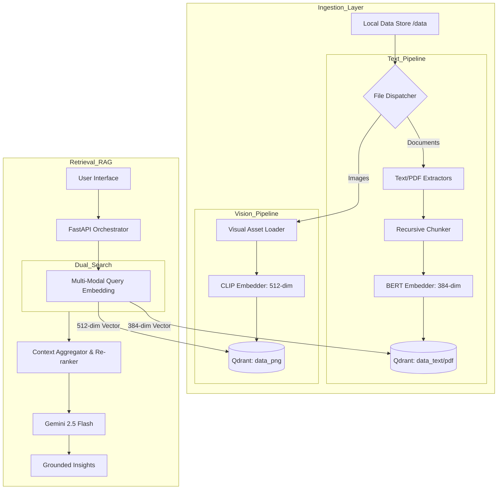

# Enterprise Multimodal RAG Chatbot

The Enterprise Multimodal RAG Chatbot is a state-of-the-art information synthesis engine designed for high-fidelity cross-modal intelligence. By harmonizing disparate data streams—including unstructured documents, complex PDFs, and visual assets—the platform delivers strategically grounded insights powered by the latest advancements in Retrieval-Augmented Generation. Leveraging a decentralized vector architecture and Google Gemini's generative capabilities, it transforms siloed organizational data into a unified, actionable knowledge base with enterprise-grade precision and scalability.

## 🚀 Key Features
- **Dual-Model Embeddings**: Uses **BERT** for precise text representation and **CLIP** for visual content understanding.
- **Vector Search**: High-speed retrieval using **Qdrant** with modality-specific collections.
- **Grounded Reasoning**: Multimodal context (text and images) is passed to **Gemini 2.5 Flash** to ensure accurate, context-aware answers.
- **Enterprise UI/UX**: A professional React-based dashboard with session management and secure authentication.
- **Incremental Sync**: Intelligent data pipeline that only re-processes changed or new files.

## 🏗 Architecture Flow



# Architecture Discussion:
The system architecture is built on the principle of Modality Isolation. Instead of forcing text and images into a single, potentially noisy shared latent space, we maintain dedicated pipelines for each data type. This ensures that the linguistic precision of BERT and the visual-semantic understanding of CLIP are preserved at their native resolutions. The FastAPI Orchestrator acts as a bridge, managing parallel retrieval across multiple Qdrant collections and synthesizing the results before hand-off to the LLM. + +### Multimodal Vector Strategy & Similarity Search 
The current logic effectively manages disparate vector dimensions to optimize retrieval accuracy Textual Dimensions (BERT):

Data Embedding: Text chunks from PDFs, Markdown, and Word docs are processed via all-MiniLM-L6-v2, resulting in 384-dimensional vectors.
Collection: Stored in data_pdf and data_text. 
Visual Dimensions (CLIP):
Data Embedding: Images are processed via openai/clip-vit-base-patch32, resulting in 512-dimensional vectors.
Collection: Stored in data_png.
Query Orchestration:
When a user submits a query, the string is embedded twice in parallel:

   *   A **384-dim query vector** is generated for searching text collections.
   *   A **512-dim query vector** (using CLIP's text encoder) is generated for searching image collections.

# Similarity & Search Logic:

The system performs Cosine Similarity searches within each collection independently.
Results are aggregated based on their similarity scores. High-scoring text chunks and images are then merged into a unified context block.
Images are retrieved from local storage and passed as raw bytes alongside the text prompt to Gemini, allowing the LLM to perform final cross-modal reasoning.


## 🛠 Technologies
- **Language**: Python 3.11+
- **Frontend**: React, TypeScript, Vite
- **Backend**: FastAPI, Uvicorn
- **AI/ML**: EmbedAnything (BERT & CLIP), Google Generative AI (Gemini)
- **Database**: Qdrant (Local Persistent Mode)

## 📋 Prerequisites
- Python 3.11+
- Node.js & npm
- Google Gemini API Key

## ⚙️ Installation & Configuration

### 1. Backend Setup
This project uses **Poetry** for dependency management.

```bash
poetry install
poetry shell
```

### 2) Configure environment
```bash
cp .env.example .env
```

Set:
- `GEMINI_API_KEY`
- Quadrant connection settings (as required by your Quadrant setup)
- EmbedAnything model/params (if required)

### 3) Ingest local data into Quadrant
```bash
python -m rag_multimodal.ingest.run_ingest --data-dir data
```

### 4) Ask questions (CLI chatbot)
```bash
python -m rag_multimodal.chat.cli_chat --data-dir data
```

## Project layout
- `rag_multimodal/ingest/*`: ingestion pipeline (PDF + PNG -> chunks -> embeddings -> Quadrant upsert)
- `rag_multimodal/rag/*`: retrieval + prompt construction for Gemini
- `rag_multimodal/chat/*`: CLI chat loop

## Notes
This repo currently contains only the `data/` folder. All code is scaffolded from scratch for the MVP.
If any of the EmbedAnything / Quadrant import paths differ from what’s assumed, update the small wrapper modules in:
- `rag_multimodal/ingest/embed_anything.py`
- `rag_multimodal/ingest/quadrant_store.py`
