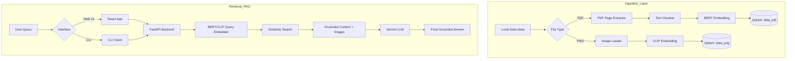

# Enterprise Multimodal RAG Chatbot

A sophisticated **Retrieval-Augmented Generation (RAG)** system capable of performing multimodal analysis across diverse data types including PDFs and images. This project leverages **EmbedAnything** for local high-performance embeddings, **Qdrant** for vector storage, and **Google Gemini** for grounded, intelligent responses.

## 🚀 Key Features
- **Multimodal Ingestion**: Seamlessly processes PDF documents and PNG images from a local directory.
- **Dual-Model Embeddings**: Uses **BERT** for precise text representation and **CLIP** for visual content understanding.
- **Vector Search**: High-speed retrieval using **Qdrant** with modality-specific collections.
- **Grounded Reasoning**: Multimodal context (text and images) is passed to **Gemini 2.5 Flash** to ensure accurate, context-aware answers.
- **Enterprise UI/UX**: A professional React-based dashboard with session management and secure authentication.
- **Incremental Sync**: Intelligent data pipeline that only re-processes changed or new files.

## 🏗 Architecture Flow



## 🛠 Technologies
- **Language**: Python 3.11+
- **Frontend**: React, TypeScript, Vite
- **Backend**: FastAPI, Uvicorn
- **AI/ML**: EmbedAnything (BERT & CLIP), Google Generative AI (Gemini)
- **Database**: Qdrant (Local Persistent Mode)

## 📋 Prerequisites
- Python 3.11
- Node.js & npm
- Google Gemini API Key

## ⚙️ Installation & Configuration

### 1. Backend Setup
This project uses **Poetry** for dependency management.

```bash
poetry install
poetry shell
```

### 2) Configure environment
```bash
cp .env.example .env
```

Set:
- `GEMINI_API_KEY`
- Quadrant connection settings (as required by your Quadrant setup)
- EmbedAnything model/params (if required)

### 3) Ingest local data into Quadrant
```bash
python -m rag_multimodal.ingest.run_ingest --data-dir data
```

### 4) Ask questions (CLI chatbot)
```bash
python -m rag_multimodal.chat.cli_chat --data-dir data
```

## Project layout
- `rag_multimodal/ingest/*`: ingestion pipeline (PDF + PNG -> chunks -> embeddings -> Quadrant upsert)
- `rag_multimodal/rag/*`: retrieval + prompt construction for Gemini
- `rag_multimodal/chat/*`: CLI chat loop

## Notes
This repo currently contains only the `data/` folder. All code is scaffolded from scratch for the MVP.
If any of the EmbedAnything / Quadrant import paths differ from what’s assumed, update the small wrapper modules in:
- `rag_multimodal/ingest/embed_anything.py`
- `rag_multimodal/ingest/quadrant_store.py`
